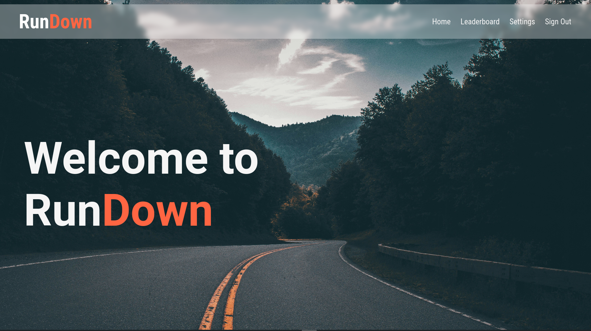
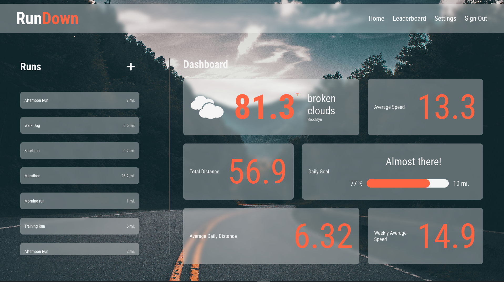

# Rundown

This is a run-tracker app created for General Assembly project 2.

### Screenshots

### Getting started

- The deployed website can be found [here](https://rundown-58b9d07143ca.herokuapp.com/runs).

* The planning materials for this project can be found [here](https://trello.com/b/lBNjgEKV/ga-project-2).

### Attributions

The weather icons are from [here](https://websygen.github.io/owfont/)

### Technologies Used

- HTML
- CSS
- JavaScript
- Node.js
- Express
- MongoDB

### Next Steps

Next for this project I would like to improve the styling, add show links on the leaderboard page, and add like functionality.
